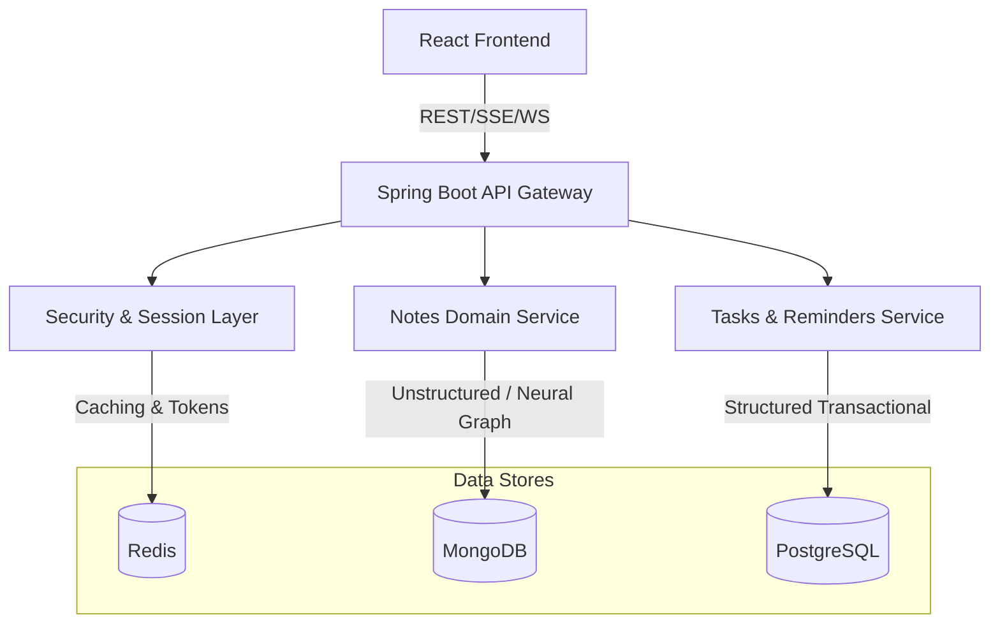
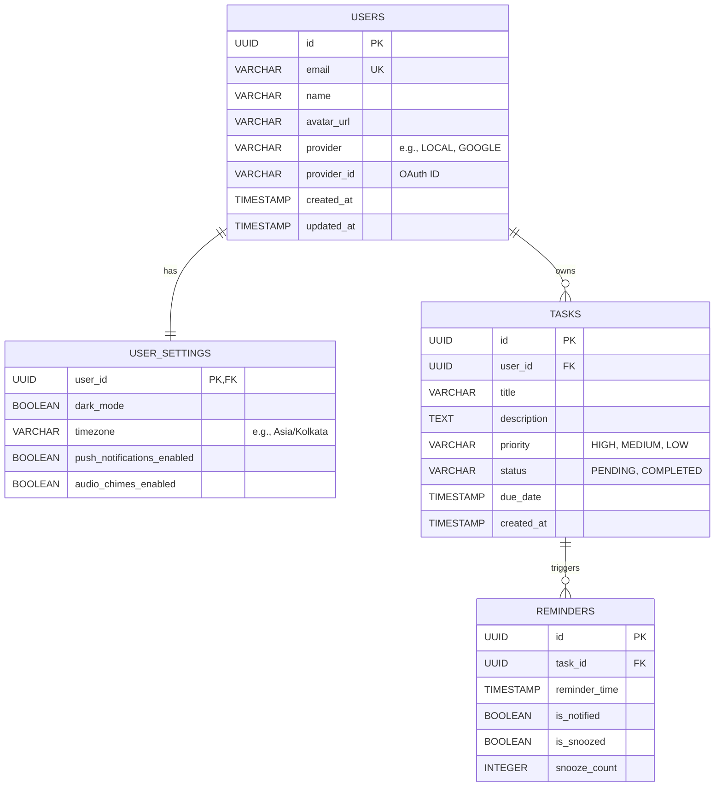
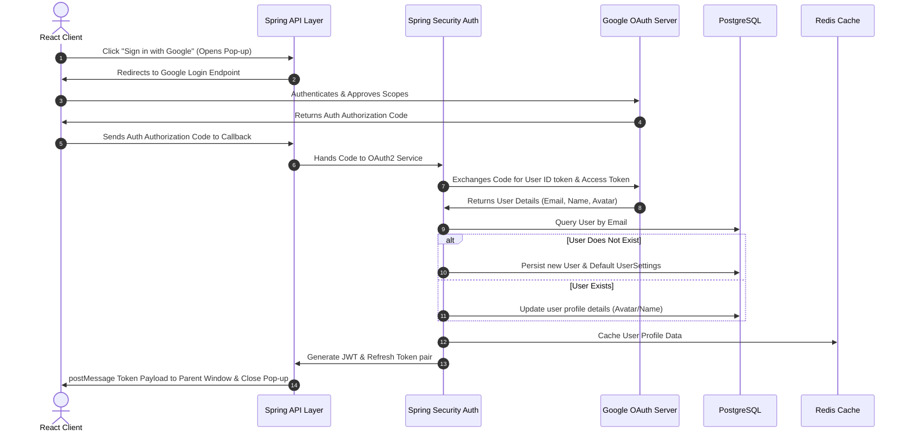
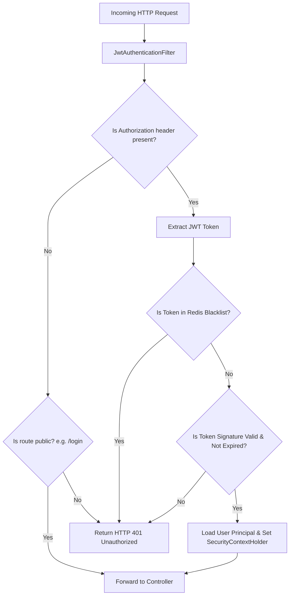
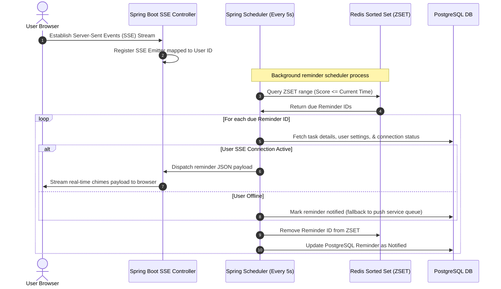
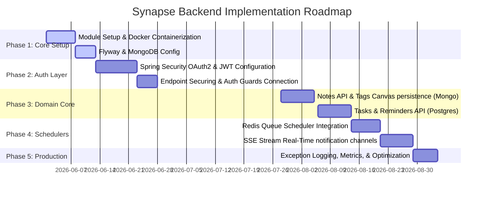

# 🧠 Synapse — Backend Architecture Blueprint
**Author:** Senior Java Architect  
**Project:** Synapse Backend  
**Target Stack:** Java 21, Spring Boot 3.5.x, PostgreSQL, MongoDB, Redis, OAuth2 Google, JWT, Flyway, Docker  

This blueprint outlines the complete, production-grade backend architecture for **Synapse**. It details the hybrid database strategy, folder structures, database schemas, sequence flows, caching patterns, API versioning, error handling, and container deployment topology.

---

## 🏛️ 1. System Design & Hybrid DB Strategy

Synapse operates on a **Polyglot Persistence** model to optimize storage engines based on the specific read/write characteristics, structure, and transactional guarantees of each domain:



### Storage Mapping Decision Grid

| Feature Area | Storage Engine | Rationale |
| :--- | :--- | :--- |
| **User Identity & Auth** | **PostgreSQL** | Strict consistency, ACID transactional integrity for user registration, and relational references (1-to-many relationship with settings/tasks). |
| **Notes & Tag Canvas** | **MongoDB** | Rich-text contents, custom block types, nesting hierarchies, and variable drag-and-drop coordinates for the neural visual canvas. Document structures adapt without migration bottlenecks. |
| **Tasks & Reminders** | **PostgreSQL** | Relational state, audit trails, index-friendly time fields, and strict constraint requirements. Reminders link directly to user IDs and require atomic transactions. |
| **Settings & Theme** | **PostgreSQL** | Key-value records or structured user-preference settings linked to User credentials. |
| **Reminders Queue & SSE** | **Redis** | High-throughput, low-latency message broker and in-memory sorted sets. Redis acts as a real-time event distribution scheduler for firing time-sensitive alert chimes. |
| **Session Cache & API Rate Limits** | **Redis** | Temporary session context storage, distributed rate-limiting, and blacklisted/revoked JWT tracking. |

---

## 📂 2. Micro-Module Architecture & Directory Structure

To maintain clean separation of concerns and enable modular scaling, Synapse utilizes a multi-module Maven structure.

### Module Topology
- `synapse-parent`: Maven parent POM declaring dependency management and compiler parameters.
- `synapse-api`: Entrypoint module containing Controllers, API filters, DTO definitions, Security config, and API documentation.
- `synapse-core`: Domain core module hosting Business Logic (Services), Domain Entities, and Repository interfaces.
- `synapse-infra`: Infrastructure configuration module containing database connector providers (JPA, Mongo, Redis), Flyway migration scripts, and external system integrations.

```text
synapse-backend/
├── pom.xml                                   # Parent POM (Dependency management)
├── synapse-api/
│   ├── pom.xml
│   └── src/main/java/com/synapse/api/
│       ├── controller/
│       │   ├── v1/                           # API v1 Versioning
│       │   │   ├── AuthController.java
│       │   │   ├── NotesController.java
│       │   │   ├── TasksController.java
│       │   │   └── DashboardController.java
│       │   └── advice/
│       │       └── GlobalExceptionHandler.java # Global RFC 7807 Exception handler
│       ├── dto/
│       │   ├── request/
│       │   │   ├── LoginRequest.java
│       │   │   ├── NoteSaveRequest.java
│       │   │   └── TaskCreateRequest.java
│       │   └── response/
│       │       ├── AuthResponse.java
│       │       ├── NoteResponse.java
│       │       └── DashboardStatsResponse.java
│       ├── filter/
│       │   └── JwtAuthenticationFilter.java  # JWT validator filter
│       └── security/
│           ├── SecurityConfig.java           # Spring Security 6 config
│           └── CustomOAuth2UserService.java  # Custom OAuth2 user detail loading
├── synapse-core/
│   ├── pom.xml
│   └── src/main/java/com/synapse/core/
│       ├── domain/                           # Relational Entities (Postgres)
│       │   ├── User.java
│       │   ├── UserSettings.java
│       │   ├── Task.java
│       │   └── Reminder.java
│       ├── service/                          # Business Interfaces & Implementations
│       │   ├── AuthService.java
│       │   ├── NoteService.java
│       │   ├── TaskService.java
│       │   └── ReminderScheduler.java
│       └── repository/                       # Database interfaces (JPA & Mongo)
│           ├── UserRepository.java
│           ├── TaskRepository.java
│           └── ReminderRepository.java
├── synapse-infra/
│   ├── pom.xml
│   └── src/main/resources/
│       ├── db/
│       │   └── migration/                    # Flyway migrations
│       │       ├── V1__init_auth_schema.sql
│       │       └── V2__create_tasks_reminders_schema.sql
│       ├── application-dev.yml
│       └── application-prod.yml
```

---

## 🗄️ 3. Relational Entity Design (PostgreSQL)

PostgreSQL stores core relational entities. Database creation and changes are managed by **Flyway** migration scripts.



### PostgreSQL Indexes & Performance Strategy
- **`idx_users_email`**: Unique hash index on `users.email` for quick authentication checks.
- **`idx_tasks_user_status`**: Composite B-Tree index on `(user_id, status)` to optimize loading pending tasks for dashboard calculation.
- **`idx_reminders_query`**: Composite index on `(is_notified, reminder_time)` to support efficient background cron lookups for pending reminders.

---

## 🍃 4. Document Schema Design (MongoDB)

Notes and their connection nodes are stored in MongoDB to provide unstructured document mapping, hierarchical nested tags, and 2D canvas layouts without constraints.

### Collection: `notes`
```json
{
  "_id": "65f80b9e8d1234a56789beef",
  "userId": "d3b07384-d113-4a1b-a5d6-d62d29486cbb",
  "title": "Project Brainstorm",
  "content": "Meeting notes regarding Synapse architecture.",
  "isPinned": true,
  "tags": ["work", "architecture", "design"],
  "canvasPosition": {
    "x": 250.5,
    "y": 180.0
  },
  "connections": [
    "65f80c108d1234a56789f001",
    "65f80c158d1234a56789f002"
  ],
  "createdAt": "2026-05-21T08:30:00Z",
  "updatedAt": "2026-05-21T08:35:12Z"
}
```

### MongoDB Index Strategy
- **Single Field Index**: `{ userId: 1 }` to retrieve user-specific notes rapidly.
- **Multi-key Index**: `{ tags: 1 }` to scan tags array lists.
- **Text Index**: `{ title: "text", content: "text" }` to support free-text fuzzy searching across notes.

---

## ⚡ 5. Redis Key-Value & Caching Strategy

Redis is configured with two distinct memory policies:
1. **Eviction-friendly Cache** (`volatile-lru`): For standard controller page data caches.
2. **Persistent Store** (`noeviction`): For real-time active reminder schedules and security tokens.

### Redis Key Patterns

| Key Pattern | Data Structure | TTL | Purpose |
| :--- | :--- | :--- | :--- |
| `synapse:auth:token:{jwt_id}` | String | 1 Hour (matching JWT expiry) | Blacklist cache containing revoked, logged-out, or rotated JSON Web Tokens. |
| `synapse:user:profile:{user_id}` | Hash | 24 Hours | Caches profile metadata to eliminate PostgreSQL DB queries on every authenticated request. |
| `synapse:rate:limit:{ip_address}` | String | 1 Minute | Slit-window rate limiter counter to protect login/signup endpoints from brute-force attacks. |
| `synapse:reminders:zset` | Sorted Set (ZSET) | Perpetual | Sorted set where Value = `reminder_id`, Score = `reminder_timestamp` (epoch millis). Used to poll upcoming reminders. |

---

## 🔄 6. System Sequence & Flowcharts

### Authentication & Registration Flow (Google OAuth2 + JWT)
The backend utilizes OAuth2 Authorization Code flow to securely verify identity via Google APIs before generating native application tokens.



---

### Request Authorization Pipeline
Every API request passes through a stateless filtering boundary before hitting controller route mappings:



---

### High-Volume Reminder Notification & Scheduling Flow
Using Redis as an in-memory queue prevents database-bound cron queries and ensures sub-second reminder notification firing times:



---

## 🛠️ 7. Architecture Strategies & Patterns

### DTO (Data Transfer Object) Strategy
Direct entity mapping is strictly forbidden at boundary levels. Instead, controllers map requests and responses using structural DTO segments:
- **`Request DTOs`**: Enforce structural validation rules using `jakarta.validation.constraints` (e.g., `@NotBlank`, `@Email`, `@FutureOrPresent`).
- **`Response DTOs`**: Read-only projections encapsulating only required data fields, eliminating relational circular references.
- **`Mapping Layer`**: Implemented using **MapStruct** for lightning-fast compile-time entity-to-DTO conversion.

### Global Exception & Error Resolution Strategy
Errors are returned using standard **RFC 7807 (Problem Details for HTTP APIs)** objects via a global `@ControllerAdvice` handler:

```json
{
  "type": "https://api.synapse.com/errors/validation-failed",
  "title": "Validation Failed",
  "status": 400,
  "detail": "The deadline date cannot be set in the past.",
  "instance": "/api/v1/tasks",
  "errors": {
    "dueDate": "Must be a future or present date."
  },
  "timestamp": "2026-05-21T14:10:00Z"
}
```

### API Versioning Scheme
All endpoints utilize URL path-based versioning to prevent breaking changes:
- Path format: `/api/v1/{resource}`
- Legacy pathways route to deprecation handlers when updated versions roll out.

---

## 🐳 8. Container Infrastructure (Docker Compose)

The multi-container configuration networks the Spring application container with its supporting database and cache topologies:

```yaml
services:
  postgres:
    image: postgres:16-alpine
    container_name: synapse-postgres
    ports:
      - "5432:5432"
    environment:
      POSTGRES_DB: synapse
      POSTGRES_USER: synapse_dev
      POSTGRES_PASSWORD: dev_password
    volumes:
      - postgres_data:/var/lib/postgresql/data
    networks:
      - synapse-network

  mongodb:
    image: mongo:7.0
    container_name: synapse-mongodb
    ports:
      - "27017:27017"
    environment:
      MONGO_INITDB_DATABASE: synapse
    volumes:
      - mongo_data:/data/db
    networks:
      - synapse-network

  redis:
    image: redis:7.2-alpine
    container_name: synapse-redis
    ports:
      - "6379:6379"
    command: redis-server --save 60 1 --loglevel warning
    volumes:
      - redis_data:/data
    networks:
      - synapse-network

  synapse-app:
    image: openjdk:21-slim
    container_name: synapse-app
    build:
      context: .
      dockerfile: Dockerfile
    ports:
      - "8080:8080"
    environment:
      SPRING_PROFILES_ACTIVE: prod
      SPRING_DATASOURCE_URL: jdbc:postgresql://postgres:5432/synapse
      SPRING_DATA_MONGODB_URI: mongodb://mongodb:27017/synapse
      SPRING_DATA_REDIS_HOST: redis
    depends_on:
      - postgres
      - mongodb
      - redis
    networks:
      - synapse-network

volumes:
  postgres_data:
  mongo_data:
  redis_data:

networks:
  synapse-network:
    driver: bridge
```

---

## 🗺️ 9. Implementation Roadmap


